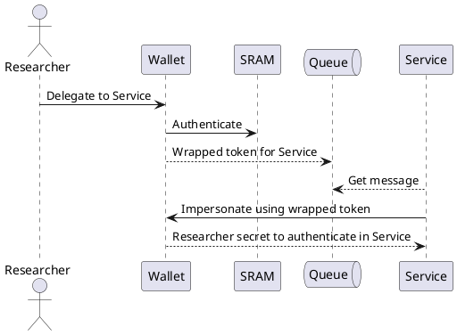
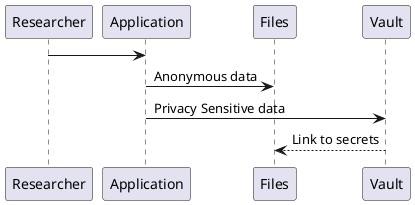
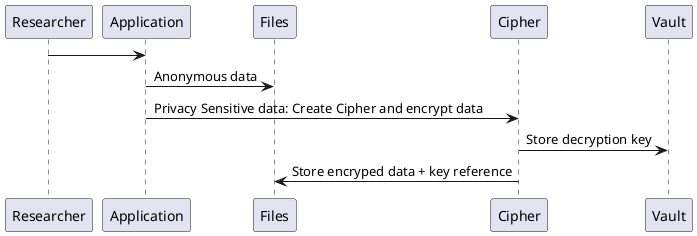

# Diagrams

### SRAM Authentication Generic Flow

This is the genric flow for services connected to **SRAM**. Users are redirected to **SRAM** for authentication. Via **SRAM** the user may select his home institute as their **Identity Provider**

```plantuml
!include assets/SRAM_Authentication.iuml
```

### Secrets Wallet Service

The wallet application allows authenticated users to pick up some secrets that are required to operate various services.

```plantuml
!include assets/wallet.iuml
```

### Token Wrapping for Impersonating users

Using token wrapping to handover access to user secrets to services in order to allow the service to access secrets on behalf of a certain secret owner.

```plantuml
!include assets/wrapping.iuml
```

[Step by step explanation...](wrapping.md)

### SRAM - Service Impersonation




### Privacy Sensitive Research Data Vault

___Under construction___

1. Store Privacy Senstive data in a Vault. Link back the reference to the privacy data in Files.



2. Store Privacy Senstive data encrypted in files. Store encryption key in Vault.




### SRAM to Vault Synchronization

___Under construction___

```plantuml
!include assets/sync_vault.iuml
```

### SRAM to iRODS Synchronization

___Under construction___

```plantuml
!include assets/sync_irods.iuml
```

### SRAM to AzureAD Synchronization

___Under construction___

```plantuml
!include assets/azure.iuml
```
