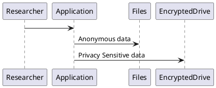
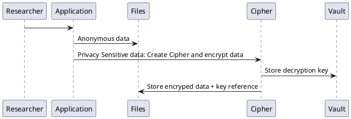

### Privacy Sensitive Research Data Vault

___Under construction___

1. Store Privacy Senstive data in a Vault. Link back the reference to the privacy data in Files.

2. Store Privacy Senstive data encrypted in files. Store encryption key in Vault.

Sleutelbestand staat in de kluis